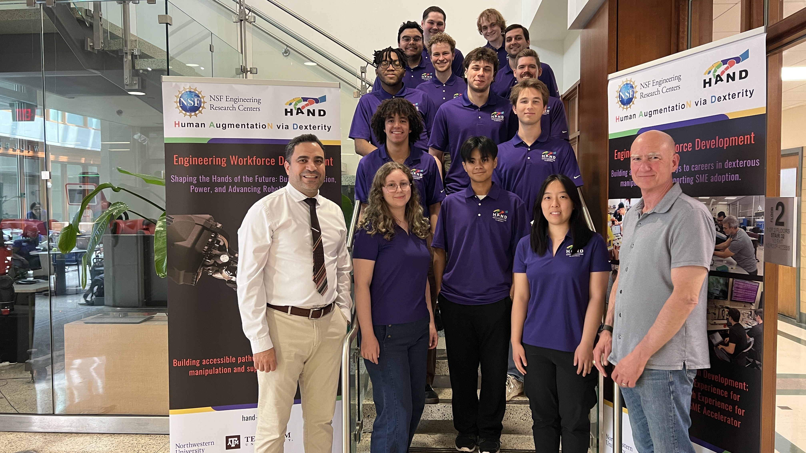
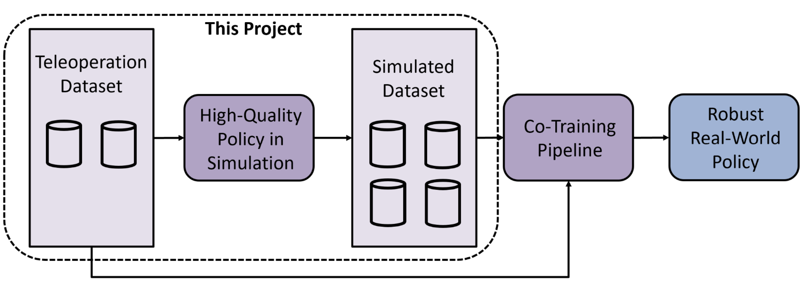
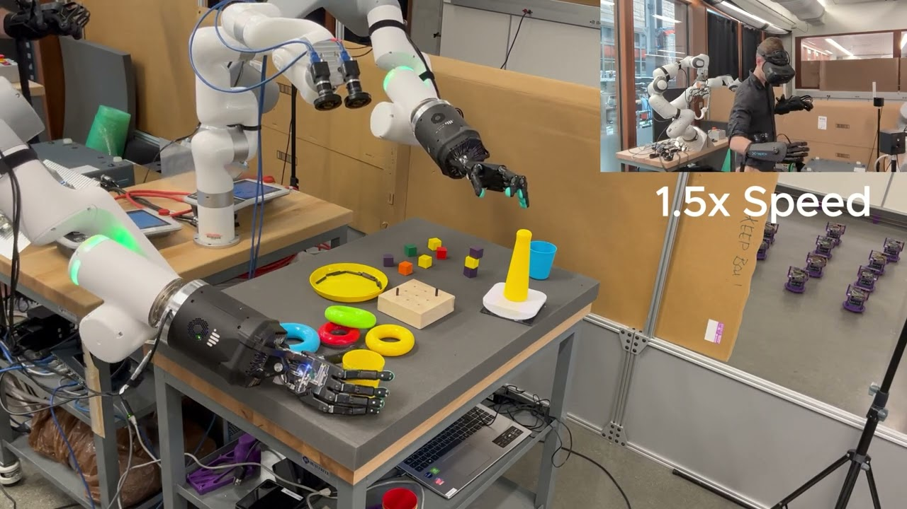
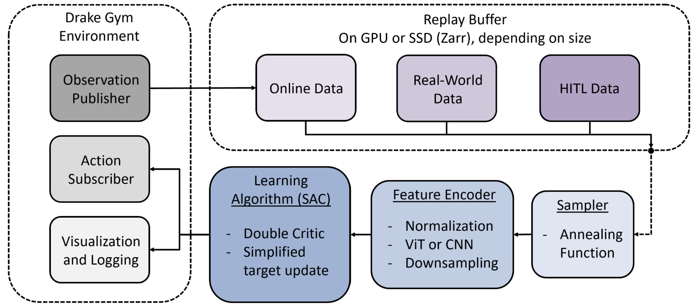

This project was associated with the Human AugmentatioN Via Dexterity Engineering Research Center (HAND ERC) at Northwestern University, and supported by the National Science Foundation (NSF).

  <iframe 
    src="https://www.youtube.com/embed/iCxZ1pmZwoE?si=f_e5PD_gCbXV0bhR" 
    frameborder="0" 
    allowfullscreen 
    style="position: absolute; top:0; left: 0; width: 100%; height: 100%;">
  </iframe>

#### Objective

My research grant was part of the NSF's Research Experience for Undergraduates (REU) program. Below is a picture of me with the rest of the REU cohort and Professors Gharib and Colgate, who serve as the REU Coordinator and HAND ERC Director respectively. 

HAND ERC is a center that aims to develop highly dexterous robots to augment human labor and make robots easier to use. They are the most prominent dexterous robotics hub in the country, and aim to revolutionize the field in the next few years. My team's goal was to create a suite of autonomous manipulation skills that can be used out of the box, making robotics more approachable for small to medium sized manufacturers.

This summer I was funded by the NSF to develop a reinforcement learning (RL) pipeline for developing autonomous skills on a high DOF dexterous manipulation avatar named DexNex. More specifically, my pipeline was built to train a simulated policy that could generate data to train a diffusion model ([Sim-and-Real Co-Training](https://arxiv.org/abs/2503.22634)). The diagram above outlines this process.

Dr. Russ Tedrake from MIT is one of our project leads, so we are using his lab's [Drake simulator](https://drake.mit.edu/) to do all of our simulation. Drake is a simulator they developed particularly for robotics and control applications. We are also using OpenAI's Gymnasium API for easy and generalizable environment functionality during the training process. The DexNex avatar is a bimanual manipulation avatar that can be controlled for teleoperation purposes using ROS2 and haptic gloves. Features include first-person VR support, touch feedback through the gloves, and real-time hand and head tracking. The picture above shows the DexNex avatar in action during a teleoperation test.

#### RL Pipeline Overview

Pictured above is a diagram of the RL pipeline I designed. 

The first stage of my project consisted of improving the simulation fidelity and building systems in Drake for RL. In this stage I:

1. Improved task environment simulation fidelity and speed, and reworked the free-body physics implementation.
2. Created Drake systems for recording observations, receiving actions, and publishing data for visualization and logging.

The next stage involved creating the training pipeline. Drake has very limited public support for reinforcement learning, so I had to modify existing code and also create a lot of the functionality from scratch. In this stage I:

1. Created training and policy playback scripts.
2. Built a custom feature encoder for normalizing and processing observation data. This includes options for both a CNN and Vision Transformer for encoding image data.
3. Integrated Drake into the Stable Baselines software stack, and tested functionality with a basic task.
4. Added support for Wandb, which allows us to easily view training progress in real-time.

I was able to train our agent with a simple task (approaching a specified point in the environment), so I moved on to creating most of our custom systems. In this stage I:

1. Created a custom replay buffer. Because we want to use teleoperation demonstrations to bootstrap the learning process, it's essential that we use an offline algorithm. To that end, I created a custom replay buffer that can efficiently access demonstration data stored on SSD, and load it into the training data in real-time. Our replay buffer also has a custom sampler that determines the proportion of online observations to demo observations to use at any given timestep during training.

2. Built a custom Soft Actor Critic (SAC) implementation. My included support for relative actions instead of only absolute actions, joint limit protections, and normalization + action sampling methods.

Because I completed this work efficiently, I also had the opportunity to perform some testing of the pipeline.

#### Pipeline Testing
While the RL pipeline I built is generalizable to any task, we used a specific task for testing. The task environment is two boxes, with a divider in between. The agent must pick up a block from one box, and place it in the other. We chose this task because it requires some dexterity, but can also be completed relatively easily and with a single arm. Our observations for training included RGB images from a single camera, ground truth task object configurations, block faces, joint configurations, and contact information at the fingertips.

Our initial goal was to use a sparse reward signal; the robot would receive a positive signal for dropping the block into the correct box, and no signal otherwise. However, this approach had some issues including critic instability and convergence to local minima. Critic instability is more likely to happen when similar states can result in drastically different reward signals. As shown in the video below, the agent learned to copy similar motions to what would result in a positive reward, as it would have learned from the demonstrations. However, because of the discrepancies between the real-world demonstrations and the simulated environment, it's possible the learned behaviors from the demos would not correlate to success in simulation. It's possible that, upon learning to copy the demos and not receiving a reward in simulation, the critic lost confidence in its predictions and became unstable.

  <iframe 
    src="https://www.youtube.com/embed/yAdTcftJb0w?si=IdMdV4aTrLzADSHu" 
    frameborder="0" 
    allowfullscreen 
    style="position: absolute; top:0; left: 0; width: 100%; height: 100%;">
  </iframe>

We also performed some testing with a more continuous reward signal and no demonstrations. While this also saw some success, it is not ideal. Breaking a task down into subtasks and providing a reward for each may see easier results, but it also limits the "creativity" of the agent in determining an optimal strategy for success.

#### Results and Future Work
While our limited testing wasn't entirely successful, our results are still quite promising. Demonstrations from the simulated environment may give us better returns with a sparse reward function. Therefore, our team has recently finished support for hardware-in-the-loop (HITL) teleoperation, which can be seen in the first video on this page. HITL teleoperation involves using the haptic gloves to control the avatar in the simulated environment. Our hypothesis is that recording demonstrations from the simulated environment will result in more efficient bootstrapping with a sparse reward. I was able to test out both the real-world and HITL teleoperation, and the touch feedback is suprisingly good for both domains!

I also had the privilege of presenting my work to the lab and other faculty in both a final presentation and poster session. Below is a picture I took with my mentor Toby during my final research symposium.

Moving forward I will be continuing my work on the RL pipeline, and working to develop the Co-Training process. Below is my poster in more detail.

<iframe 
  src="../assets/img/project_img/dexnex/poster.pdf" 
  width="100%" 
  height="600px" 
  style="border: none;">
</iframe>

