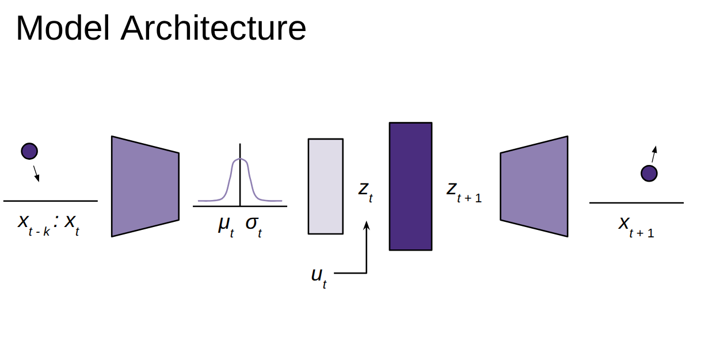
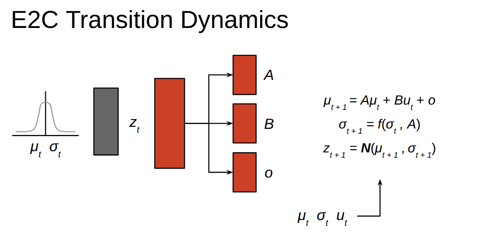
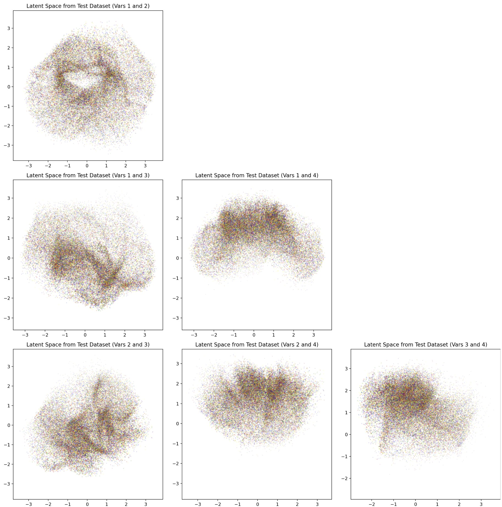

This project was associated with with my Master's thesis.

  <iframe 
    src="https://drive.google.com/file/d/134RrAXvoRoePCivQ5qLAl-FVsIevaFr8/preview" 
    width="100%" height="480" allow="autoplay"
    style="position: absolute; top:0; left: 0; width: 100%; height: 100%;">
  </iframe>

## Introduction
#### Objective
The goal of this project was to implement the architecture of Embed to Control: A Locally Linear Latent Dynamics Model for Control from Raw Images.

#### E2C Overview
E2C [1] is a latent world model architecture that is capable of learning and predicting the dynamics of nonlinear systems. First, raw images are encoded into a lower dimensional latent space. This latent variable is an abstract representation of the observed system state. The latent state at the next timestep is predicted from the latent state and control at the current timestep. This prediction is linearized by estimating the *A* and *B* matrices from the linear state space model. These matrices, along with a covariance matrix are neural network outputs. Using the linear state space model output and the predicted covariance, the following latent state can be acquired through reparameterization. The general architecture is displayed in the figures below.

What I find particularly interesting about E2C is that the original authors were able to find a correlation between the spatial structure of the latent space and the dynamics of the original control problem. I've included some latent space visualizations for the Reacher environment in this project page as a comparison.

Our implementation allows predictions to be based on an observation history rather than just a single image. We found this was able to allow crisper and more accurate predictions.

## Results
The first video on this page is a visualization of the performance our implementation can achieve. Our example uses the Reacher environment, which is arguably a more complicated system than the 2D examples in the original E2C paper. This may be a result of including observation history instead of a single image, but further study would be required for substantive analysis. 

In the video, the left column shows the true and predicted current images, where the predicted current image is simply an encoded-decoded visualization. The right column shows the true and predicted future images (one timestep later). This visualization is particularly valuable when the true current and future images are drastically different, suggesting large control magnitudes. In these cases, the model is still able to accurately predict the future states.

In the figure above, the 2D joint spaces between each latent variable are visualized in a grid. It is unclear whether there is a spatial correlation between the latent space and the original Reacher dynamics, but at least the visualizations are nice to look at.

## Future Work
For my Master's thesis, I am examining the potential of intelligent closed-loop active learning for learning dynamics models like E2C. We aim to show that active learning can decrease the amount of data needed to learn a dynamics model.

## Citations
> [1] M. Watter, J. T. Springenberg, J. Boedecker, and M. Riedmiller, “Embed to Control: A Locally Linear Latent Dynamics Model for Control from Raw Images,” in *Advances in Neural Information Processing Systems 28 (NIPS 2015)*, Montréal, Canada, Dec. 2015, pp. 2746–2754. [Online]. Available: [https://arxiv.org/abs/1506.07365](https://arxiv.org/abs/1506.07365)